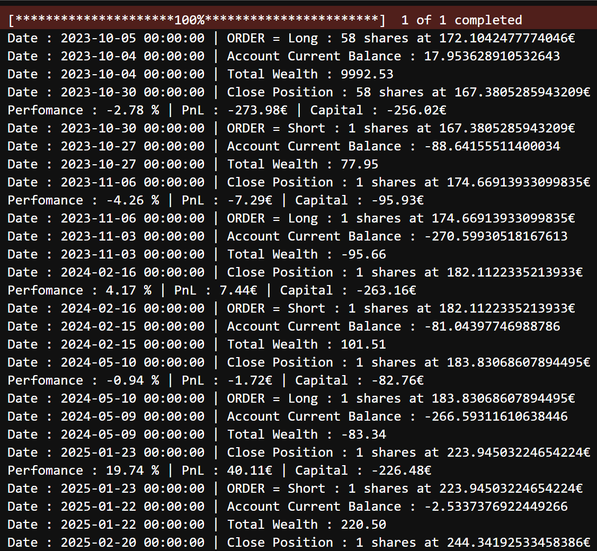
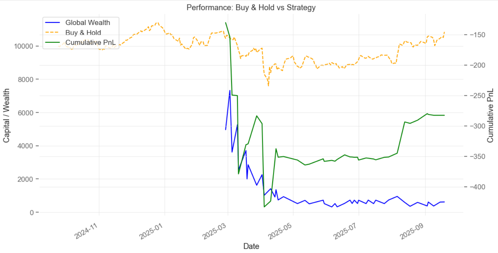

# Event‑Driven Backtesting Engine : Tick‑Level Simulation & Trade Analytics

[](https://www.python.org/)
[](LICENSE)
[]()

## Overview

Modular Python framework for **event‑driven backtesting** at tick or bar level, designed to replicate realistic trading execution.  
The engine focuses on **capital tracking, trade‑level analytics, and disciplined execution logic**, ensuring signals are generated at *t* and executed at *t+1* to eliminate look‑ahead bias.  

Validated with simple EMA and ARIMA strategies — not for performance optimisation, but to **demonstrate robustness of the framework**:  
- **Single‑position simulations** (long/short)  
- **Integrated execution logic** with realistic order handling  
- **Transparent trade journaling** for post‑analysis and risk metrics  

## Features

- **Event‑Driven Core**
  - Tick‑by‑tick or bar‑by‑bar simulation  
  - Execution at next tick/bar open → no look‑ahead bias  
  - Capital, PnL, and wealth tracking  

- **Trade Analytics**
  - Full trade journaling (side, units, entry/exit, PnL, duration)  
  - Risk metrics: Sharpe, Sortino, Max Drawdown, Gain/Loss ratio  
  - **Kelly Criterion** calculation  

- **Validation Strategies**
  - EMA crossover (trend‑following example)  
  - ARIMA forecast (time‑series example)  
  - Used only to illustrate engine behaviour  

- **Visualisation**
  - Wealth vs Buy & Hold  
  - Cumulative PnL  


## Project Structure

```
event-driven-backtester/
│ 
├── README.md                       # This file
├── utils.py                        # Helper functions and common imports
├── backtest_engine.py              # Core event-driven backtesting engine
├── tradeanalysis.py                # Post-trade analytics and performance reporting
├── ema_arima.py                    # Validation strategies (EmaCrossStrategy & ArimaTickStrategy)
├── mains_test.py                   # Main-like scripts to run strategies
├── requirements.txt                # Python libraries required
├── example.ipynb                  # Interactive demo to review code and features
└── images/
    ├── execution.png
    └── visualisation.png
```

## Requirements
- Python 3.10+  
- numpy, pandas, matplotlib, yfinance, statsmodels, quantstats, sklearn

## Installation

```bash
git clone https://github.com/<your-username>/<your-repo>.git
cd <your-repo>
python -m venv venv
source venv/bin/activate   # macOS/Linux
venv\Scripts\activate      # Windows
pip install -r requirements.txt
```

## Example Outputs

### Event-Based Execution


### Visualisation


## Next Steps

- Integrate transaction costs and slippage directly into execution (currently only applied in post‑analysis)
- Use a true tick‑by‑tick microstructure
- Integrate Kelly Criterion for dynamic sizing and allow multiple simultaneous positions
- Drawdown curve visualisation
- Implement risk management logic (stop‑loss, take‑profit)

## License
Personal project — free to use and modify for educational or demonstration purposes.